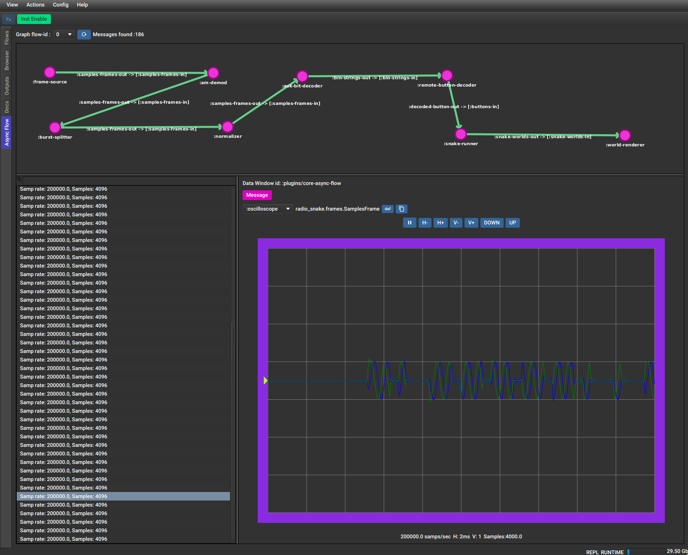

# FlowStorm core.async.flow plugin



The core.async.flow plugin allows you to visualize your core.async.flow graph recorded activity from a graph view.

**Note: this plugin is still on alpha the same as core.async.flow!**
**This plugin is currently tested against core.async d922995579ce50f0760cbfc781f1e4a6ea077ce1**

# Installation

Add [](https://clojars.org/com.github.flow-storm/flow-storm-async-flow-plugin) 
to your dependencies.

Then on some dev namespace :

```clojure
(require 'flow-storm.plugins.async-flow.all)
```

When you open the FlowStorm UI you should see a new tab like in the picture above.

The plugin needs the recordings of the internals of clojure.core.async.flow so your FlowStorm instrumentation should include 
the `clojure.core.async.flow` prefix added to your code prefixes, like `"-Dclojure.storm.instrumentOnlyPrefixes=clojure.core.async.flow,flow-test"`

# Usage

The plugin needs you to record the total order timeline, so your recordings should be made with the second (from the right) recording button
enable.

In order to extract the graph structures from the recording it needs to record the flow start of your graph, basically when
`(flow/start graph)` gets called.

After that you can draw the graph by going to the `Async Flow` plugin tab and selecting the flow-id where the graph start recordings 
are and click the refresh button.
You can move around the nodes by dragging them to improve how the graph looks.

If you want to have access to the messages going over the channels you can record them (keep recording on as you use the app) 
and then select the flow-id where the "messages activity" has been recorded and click the messages refresh. This should show
a counter with all the messages found on your recordings.

After the messages are loaded you should be able to **double-click** on a channel in the graph representation to see
the messages in the bottom panel.

Double clicking on any of these messages should take you to the code stepper right before that
message is going to be processed.


